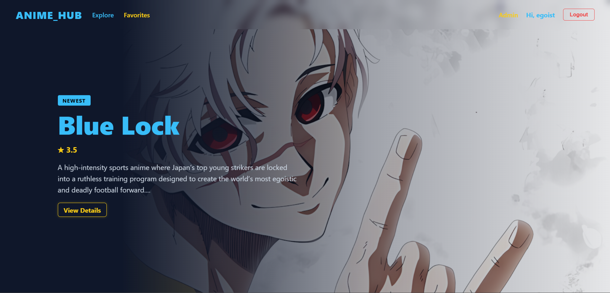
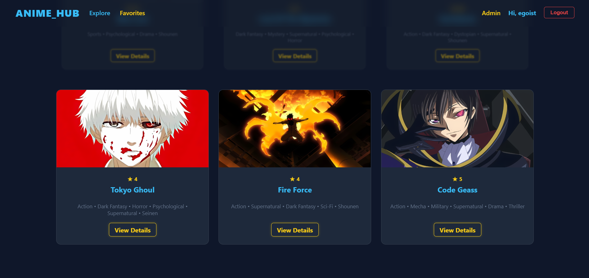
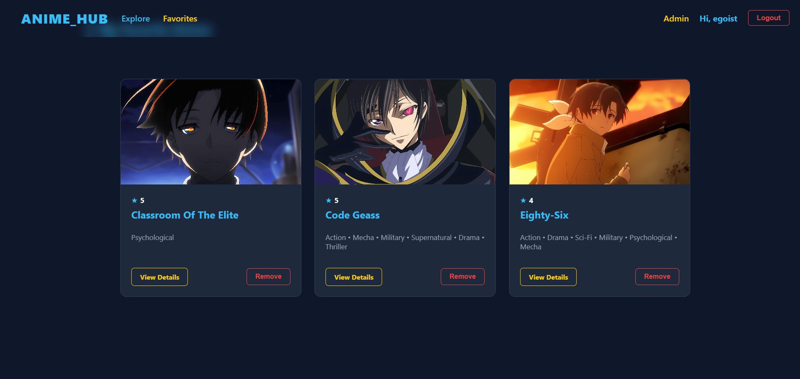
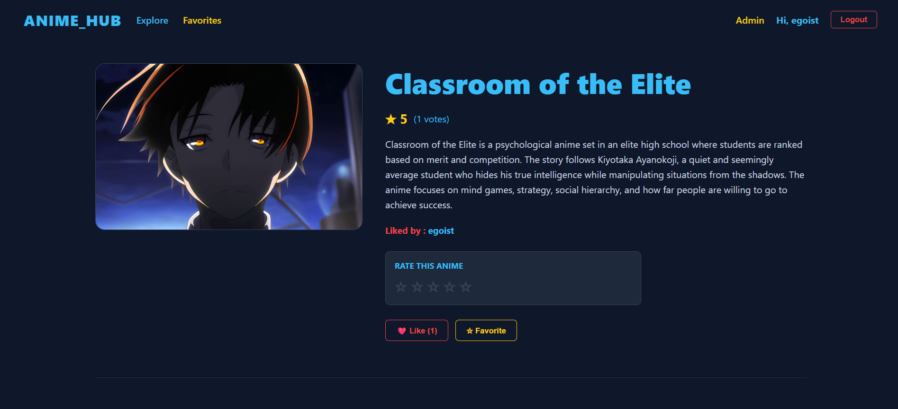
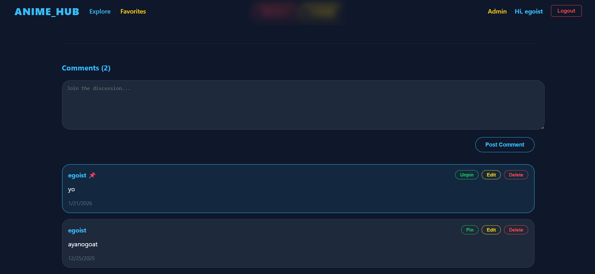
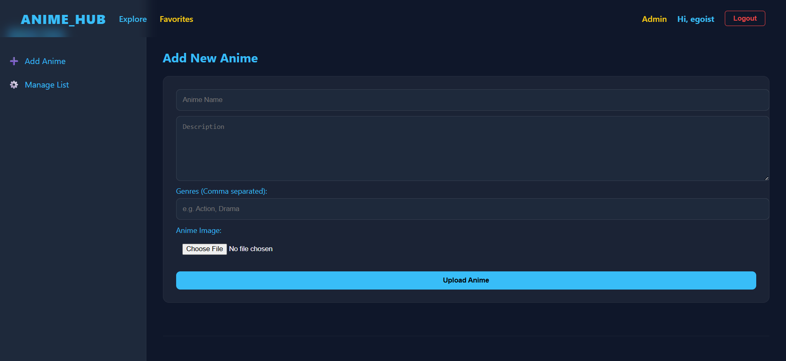
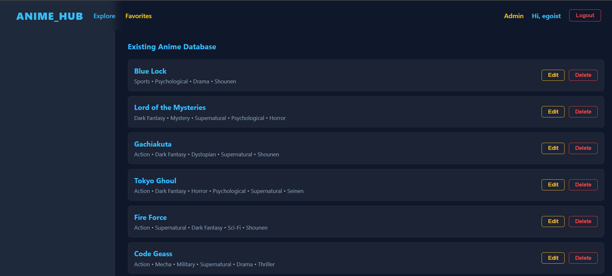
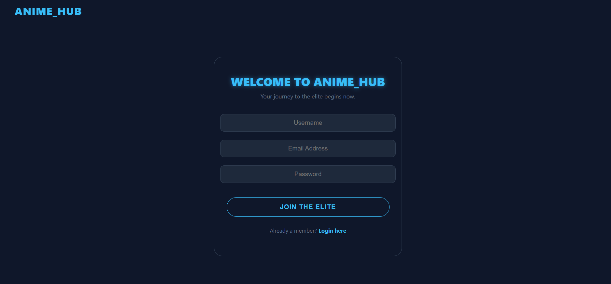
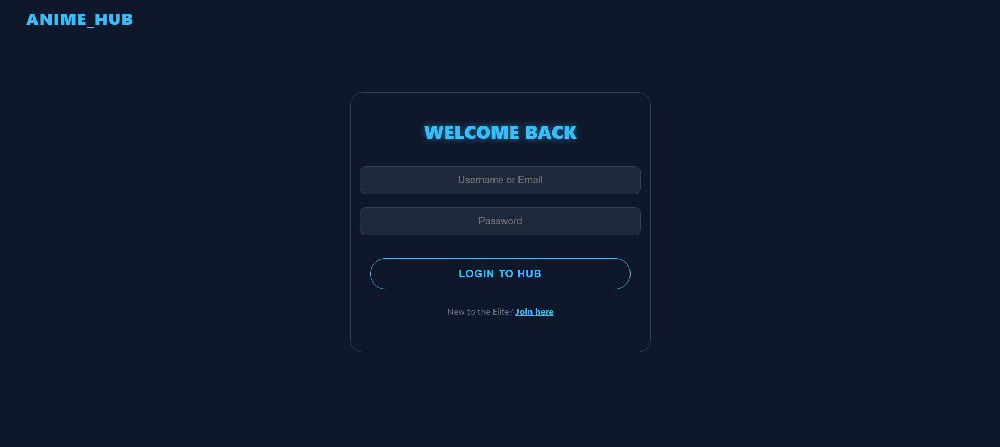

<div align="center">


<br/>

[](https://reactjs.org/)
[](https://nodejs.org/)
[](https://expressjs.com/)
[](https://mongodb.com/)
[](https://jwt.io/)
[](https://tailwindcss.com/)
[](https://vitejs.dev/)

<br/>


<br/>


</div>

<br/>

## &nbsp; What is AnimeHub?

> *AnimeHub is a robust, full-stack MERN application designed for anime enthusiasts to discover, search, and manage a personalized collection of series. The platform features a secure, role-based architecture — standard users engage through social features while administrators get exclusive tools for content management and community moderation.*

<br/>

<div align="center">

</div>

<br/>

## &nbsp; Features

<br/>

<table>
<tr>
<td width="50%" valign="top">

### &nbsp; Authentication
Secure JWT-based auth with Bcrypt password hashing. Stateless session management with protected route middleware.

<br/>

### &nbsp; Dynamic Discovery
Real-time search and multi-parameter filtering via MongoDB aggregation pipelines for instant, optimised results.

<br/>

### &nbsp; Social Interactions
Atomic like system paired with a hierarchical comment section — includes admin pinning capabilities.

</td>
<td width="50%" valign="top">

### &nbsp; Role-Based Access Control
Granular `user` and `admin` permissions enforced server-side via `protect` and `adminOnly` middleware.

<br/>

### &nbsp; Asset Management
Automated image processing and structured storage for anime covers using Multer and Express static routing.

<br/>

### &nbsp; Built for Scale
MongoDB aggregation and indexed queries ensure fast, consistent performance as the collection grows.

</td>
</tr>
</table>

<br/>

<div align="center">

</div>

<br/>

## &nbsp; Tech Stack

<br/>

<div align="center">

|  | Layer | Technology | Purpose |
|--|:------|:----------|:--------|
| ⚛️ | Frontend | React + Vite | Component UI with fast HMR |
| 🎨 | Styling | Tailwind CSS + Lucide React | Utility-first with icon library |
| 🟩 | Backend | Node.js + Express.js | RESTful API architecture |
| 🍃 | Database | MongoDB + Mongoose | Schema validation & population |
| 🔒 | Auth | JWT + Bcrypt | Stateless auth + password hashing |
| 📁 | Uploads | Multer | Image processing & static serving |

</div>

<br/>

<div align="center">

</div>

<br/>

## &nbsp; Application Preview

<br/>

<div align="center">


</div>

<br/>

---

### &nbsp; 01 &nbsp;—&nbsp; Hero Banner

<p align="center">
  
</p>

> The landing experience — bold visuals, instant navigation, and a cinematic first impression.

---

### &nbsp; 02 &nbsp;—&nbsp; Explore Anime

<p align="center">
  
</p>

> Browse the full catalogue with real-time search and multi-parameter filtering.

---

### &nbsp; 03 &nbsp;—&nbsp; Favorites

<p align="center">
  
</p>

> A personalized space to track and revisit all liked series in one place.

---

### &nbsp; 04 &nbsp;—&nbsp; View Details

<p align="center">
  
</p>

> Deep-dive into any series — synopsis, metadata, ratings, and community activity.

---

### &nbsp; 05 &nbsp;—&nbsp; Comment Section

<p align="center">
  
</p>

> Hierarchical comments with admin pinning — built for community discussion.

---

### &nbsp; 06 &nbsp;—&nbsp; Admin — Add Anime

<p align="center">
  
</p>

> Admin-only panel to upload new series with cover art, metadata, and categorisation.

---

### &nbsp; 07 &nbsp;—&nbsp; Manage Anime

<p align="center">
  
</p>

> Full CRUD control — edit, update, or remove any entry from the catalogue.

---

### &nbsp; 08 &nbsp;—&nbsp; Register Page

<p align="center">
  
</p>

> Clean onboarding flow with validation and secure credential handling.

---

### &nbsp; 09 &nbsp;—&nbsp; Login Page

<p align="center">
  
</p>

> JWT-secured login with role detection — seamlessly routes users and admins.

---

<br/>

<div align="center">

</div>

<br/>

## &nbsp; Getting Started

<br/>

**Prerequisites**
- Node.js `v18+`
- MongoDB (local or Atlas)

<br/>

**1 — Clone**
```bash
git clone https://github.com/your-username/animehub.git
cd animehub
```

**2 — Backend**
```bash
cd server && npm install
```

Create `.env` inside `/server`:
```env
MONGO_URI=your_mongodb_connection_string
JWT_SECRET=your_secret_key
PORT=5000
```
```bash
npm run dev
```

**3 — Frontend**
```bash
cd client && npm install && npm run dev
```

<br/>

<div align="center">

</div>

<br/>

<div align="center">

## &nbsp; Author

<br/>


<br/>

**Nikesh S**

<br/>

[](https://github.com/your-username)
[](https://linkedin.com/in/your-profile)
[](https://instagram.com/your-handle)

<br/>

*If you enjoy AnimeHub, drop a* ⭐ *— it means a lot!*

<br/>


</div>
